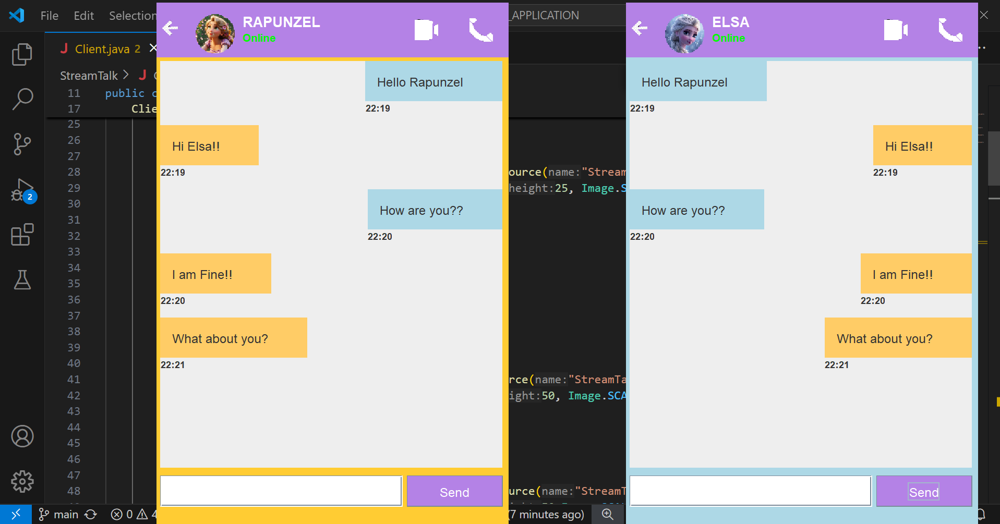

# StreamTalk
StreamTalk is a real-time messaging application built using Java Swing for the GUI and Sockets (TCP/IP) for communication. It features a client-server architecture, custom-styled chat bubbles, message timestamps, and a modern chat UI for a seamless user experience.
<br>
Author - Safa Mahveen
<br>
## OVERVIEW

## Features
- **Real-time Chat:** Instant messaging between client and server.
- **Modern UI:** Custom-styled chat bubbles with user avatars.
- **Timestamped Messages:** Each message displays the time it was sent.
- **Client-Server Architecture:** Uses TCP sockets for communication.
- **Graphical User Interface:** Built using Java Swing.
- **Exit Button:** Close the application by clicking the back button (<-).
- **User Profiles:** Each user has a display picture and status.

## How It Works:
- The **Server** (`Server.java`) listens for incoming connections on port `6001`.
- The **Client** (`Client.java`) connects to the server using the local IP (`127.0.0.1`) and port `6001`.
- Once connected, the client and server exchange messages in real-time using `DataInputStream` and `DataOutputStream`.
- The messages are displayed in a custom UI using **Java Swing**.


## Technologies Used
- Java (Swing for UI, Sockets for networking)
- AWT (Abstract Window Toolkit) for layout and event handling
- Object-Oriented Programming principles

## How to Run
### Prerequisites
- Java Development Kit (JDK) installed

### Steps
1. **Compile the Server Code:**
   ```sh
   javac StreamTalk/Server.java
   ```
2. **Run the Server:**
   ```sh
   java StreamTalk.Server
   ```
3. **Compile the Client Code:**
   ```sh
   javac StreamTalk/Client.java
   ```
4. **Run the Client:**
   ```sh
   java StreamTalk.Client
   ```
5. Start messaging between the client and server!

## Project Structure
```
StreamTalk/
│-- images/ (Images for UI)
│-- Client.java (Client-side application)
│-- Server.java (Server-side application)
│-- README.md (Project documentation)
```

